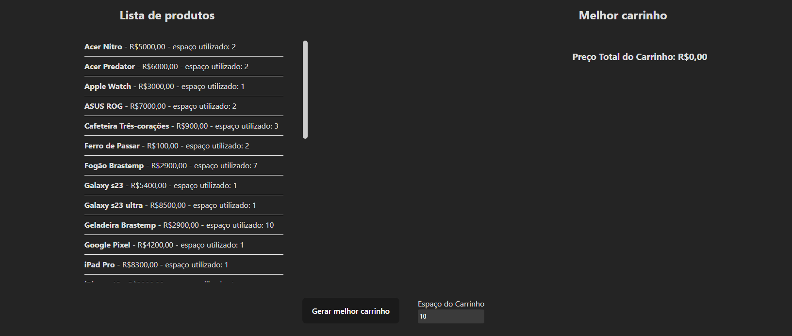
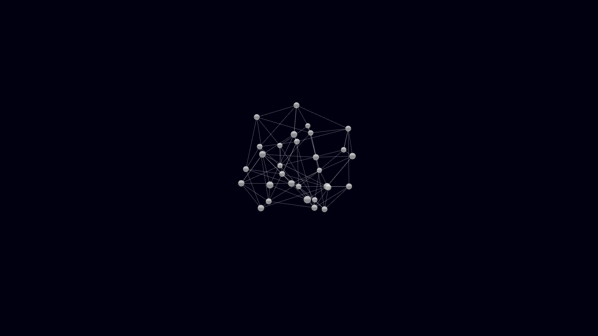
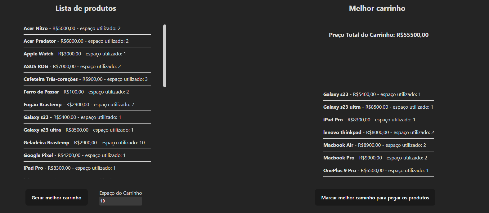
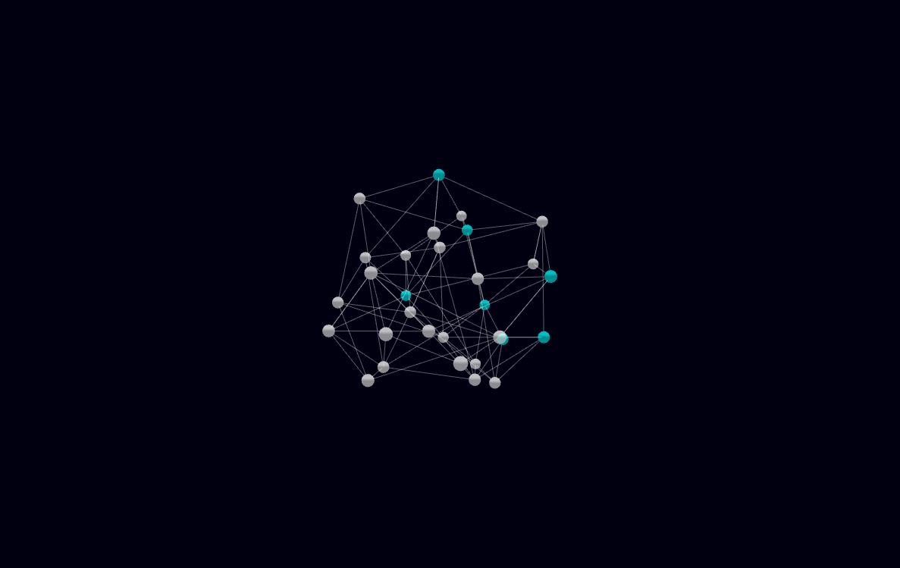
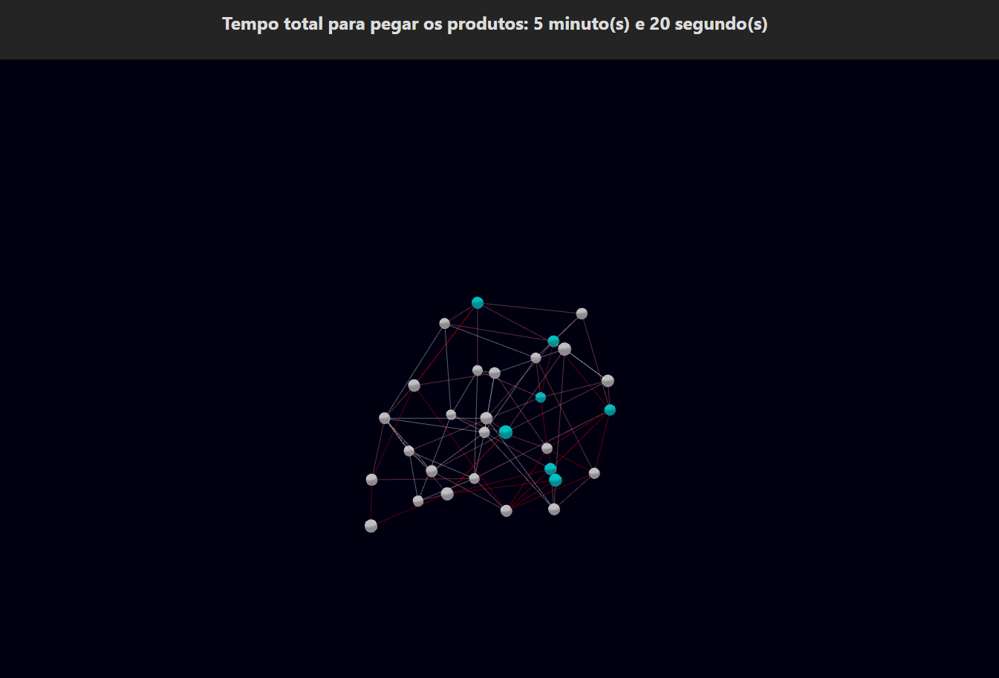

# Final_Shopping_Cart

**Número da Lista**: 6<br>
**Conteúdo da Disciplina**: Trabalho Final<br>

## Alunos
|Matrícula | Aluno |
| -- | -- |
| 19/0056843  |  Carlos Eduardo de Sousa Fiuza |
| 19/0055201  |  Matheus Calixto Vaz Pinheiro |

## Sobre 
O projeto se baseou no programa "Comprar é bom, levar é melhor" da emissora Sbt, em que uma família possui um tempo determinado para pegar todos os itens desejados e disponíveis no hipermercado, considerando que não podem extrapolar o valor máximo estabelecido.

### Estrutura
Com isso, criamos um grafo não dirigido e conectado, em que os nós representam os produtos do mercado, com as características:
- Nome do produto
- Preço do produto
- Espaço que o produto ocupa no carrinho

Além das arestas que possuem um custo determinado pelo tempo de deslocamento entre dois produtos (os corredores do mercado).

### Funcionalidades
- **Gerar melhor carrinho**: Com base no algoritmo de mochila da programação dinâmica, é gerada a melhor combinação de produtos que cabem no carrinho de tamanho definido pelo usuário, possuindo valor máximo.

- **Marcar melhor caminho para pegar os produtos**: Com base nos produtos escolhidos pelo algoritmo de mochila, é feito, iterativamente, o cálculo do menor caminho entre dois produtos (algoritmo de Dijkstra). **Obs**: (Infelizmente não conseguimos implementar a funcionalidade para gerar um único caminho ótimo para pegar todos os produtos escolhidos).

- **Visualização do grafo**: É gerado um grafo 3d para visualização de todos os produtos do mercado, sendo os nós marcados em ciano aqueles escolhidos pela mochila, e arestas marcadas em vermelho que sinalizam o melhor caminho.


## Screenshots
<div align="center">
    </img>
</div>
<div align="center">
    </img>
</div>
<div align="center">
    </img>
</div>
<div align="center">
    </img>
</div>
<div align="center">
    </img>
</div>


## Instalação 
**Linguagem**: Javascript<br>
**Framework**: React<br>
Possuir node instalado e npm ou yarn.

## Uso
Use o link para acessar a aplicação deployada: [link](https://final-shopping-cart.vercel.app/)

Ou execute em ambiente local:

1 - Baixe o repositório usando o git clone
2 - Entre na pasta Final_Shopping_Cart/Shopping-cart
3 - Execute o comando:
```bash
npm install && npm run dev
```
## Apresentação
[O vídeo pode ser encontrado aqui.](/assets/presentation.mp4)(/assets/presentation.mp4)
